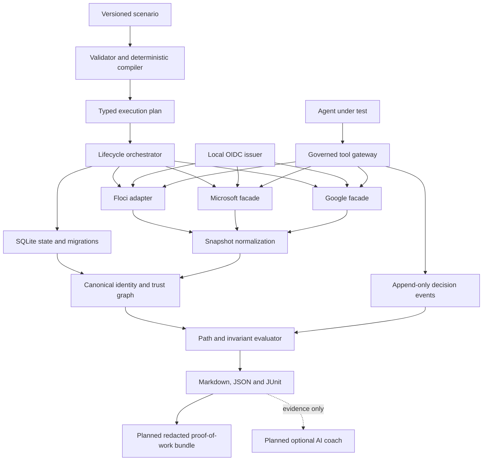

# CloudAILab master plan

## Purpose and authority

This document is the execution plan for CloudAILab. The [project charter](charter.md) defines why the project exists, the [product requirements](../01-product/requirements.md) define required behavior, accepted [architecture decisions](../02-architecture/decisions/README.md) constrain implementation, and this plan defines delivery order and evidence gates.

The plan is intentionally milestone-based rather than date-based. M0 through M3 are complete, and the `0.1.0-rc.1` artifact and release controls have been exercised successfully. M4.1 is a bounded adoption pass that must improve the first-user, external-agent, curriculum, and community-authoring experience before a replacement candidate is recorded and tagged. Post-release work applies a depth-first, breadth-by-scenario learning strategy, beginning with Azure as a distinct resource platform and then connecting delivery, runtime, security-operations, and agent-governance layers. Web-console and optional AI/ML assistance remain post-release so they cannot turn the first public release into an open-ended program.

## Product outcome

CloudAILab will be a local-first enterprise identity and AI-agent security range that lets a learner or test system:

1. Start a reproducible multi-tenant scenario.
2. Inspect and mutate supported AWS-, Microsoft-, and Google-shaped resources with documented tools or SDKs.
3. Trace human, application, workload, and agent authority across provider boundaries.
4. Investigate an attack path and apply a remediation.
5. Prove deterministically whether the path was closed without breaking intended access.
6. Evaluate an AI agent's tool use, approvals, data access, and policy compliance across repeated trials.
7. Follow the same system from source and delivery identity through deployed workload, protected data, telemetry, investigation, and remediation.
8. Export portable evidence of the environment, investigation, decisions, remediation, preserved access, verification, and limitations for personal review or a technical portfolio.

## Product strategy and priority

CloudAILab uses this product rule:

> **Teach how modern enterprise systems are built, connected, secured, operated, and governed through realistic end-to-end scenarios. Provide depth in identity and authorization, working exposure across the surrounding stack, and claim compatibility only for behavior covered by implementation and tests.**

The shorthand is **depth-first in identity and security; breadth through end-to-end scenarios**. Identity and authorization remain the technical spine and differentiator. Full-stack learning means following responsibility across connected layers; it does not mean cloning every feature of a cloud, platform, or tool. Job readiness comes from practicing that responsibility and producing inspectable evidence of the work, not from CloudAILab claiming that a user is employable.

Product work is prioritized in this order:

| Priority | Focus | Learner or user outcome |
|---|---|---|
| 1 | First-user experience | An unfamiliar user reaches a meaningful, safe success quickly and understands the boundary of the simulation. |
| 2 | End-to-end enterprise missions | A learner can connect source, delivery, identity, workload, resource, data, telemetry, investigation, and remediation. |
| 3 | Portable proof of work | A user can share a redacted, inspectable record of what they investigated, changed, preserved, verified, and cleaned up. |
| 4 | Identity and authorization depth | Knowledge transfers across AWS, Microsoft Entra, Azure, Google Workspace, later Google Cloud, Kubernetes, workload identities, and agents without conflating products or implying provider parity. |
| 5 | DevOps and cloud delivery | The learner practices Git-based change, CI workload identity, infrastructure as code, secrets, artifact provenance, and controlled deployment. |
| 6 | Runtime and platform engineering | Optional advanced missions cover containers, Kubernetes, workload identity, admission/policy controls, observability, and operational failure. |
| 7 | AI-agent security and governance | External agents are evaluated for delegated authority, tool use, approvals, data exposure, and blast radius through deterministic evidence. |
| 8 | Community extensibility | Contributors can add safe data-only scenarios, lessons, policies, and explicit trusted integrations without weakening the core. |
| 9 | Web and optional AI assistance | Visual investigation and evidence-grounded coaching improve access only after the underlying contracts are stable. |

Post-release flagship missions should normally cross at least four connected layers, such as delivery, identity, runtime/resource, data, and evidence/governance. Narrow foundation labs remain appropriate when they teach a prerequisite or isolate a security semantic that must be understood before the integrated mission.

The common curriculum core is Git and change review; HTTP, APIs, JSON, and YAML; authentication versus authorization; OAuth 2.0 and OIDC; users, groups, roles, policies, and scopes; control plane versus data plane; CI/CD identity; secrets and short-lived credentials; logs, traces, and evidence; deterministic verification; and cleanup. Specialization tracks build on that core for cloud/DevOps, IAM/security, platform engineering, security operations, AI governance, and community scenario authoring.

Portable proof of work is a product output, not a credential. A versioned evidence bundle should contain a human-readable summary and machine-readable manifest covering the CloudAILab/scenario/profile versions, compatibility boundary, initial relevant state digest and attack path, evidence references, user and agent decisions, applied remediation, required access that remained valid, final invariant results, errors or incomplete steps, and cleanup status. Exports must be deterministic from persisted evidence where possible, redact credentials and classified payloads, exclude protected ground truth, and carry an integrity manifest. Integrity detects changes to the exported files after generation; it does not prove the user's identity, independent authorship, competence outside the recorded scenario, or suitability for employment.

CloudAILab owns the sandbox and self-guided mission experience, not an institutional teaching layer. Stable scenario, lesson, evidence, reporting, and extension contracts should make external classroom products possible, but rosters, instructor dashboards, classroom orchestration, learning-management-system integrations, accreditation mapping, academic-integrity administration, and institution-specific grading workflows remain separate products maintained outside this repository.

## Non-negotiable constraints

- Security decisions, attack-path analysis, evidence, and scoring are deterministic.
- Hosted AI is optional and cannot be required for CI or core learning workflows.
- Provider compatibility is operation-specific, test-backed, and never implied globally.
- Capability grows through deep, connected scenarios rather than a broad catalog of shallow mocks, disconnected tutorials, or unsupported provider features.
- Services bind to loopback by default; credentials are synthetic; isolation claims require enforced isolation.
- The supported default deployment requires only the `cailab` binary; container-backed scenarios additionally require the documented local Docker configuration. Podman remains planned and untested.
- Documentation and tests change with behavior in the same pull request.
- A release user must not need the source repository, Go toolchain, or another private/local project to complete the supported first-run experience.
- Curriculum imported from the separately owned Learning DevOps vault is a one-time, read-only adaptation. CloudAILab has no runtime, link, submodule, or synchronization dependency on that project.
- Community extensibility begins with declarative, validated content. Executable tools, agents, and provider code remain explicitly trusted and must not be presented as equivalent to data-only scenario packs.
- Educational adoption must emerge through the sandbox's usability and stable contracts; CloudAILab does not become a classroom, LMS, instructor, or institutional administration product.
- Job-readiness claims remain evidence-bounded. CloudAILab may help users practice and demonstrate technical work, but it does not issue credentials, rank people, certify competence, guarantee employment, or make hiring recommendations.

## Evidence behind the plan

The full evidence register is maintained in [Technical Basis and Source Register](../06-research/technical-basis.md). The most consequential findings are:

- Floci provides useful AWS-shaped APIs and multi-account namespacing, but IAM enforcement and signature validation are disabled by default, and its STS implementation does not evaluate trust-policy `Condition` blocks or caller-side `sts:AssumeRole` authorization. CloudAILab therefore must own the authoritative cross-provider decision model and document the gap. [Floci STS](https://floci.io/floci/services/sts/), [Floci multi-account isolation](https://floci.io/floci/configuration/multi-account/)
- Microsoft Dev Proxy is an API simulation and resilience tool. Its dynamic CRUD support is valuable, but it is not an Entra authorization engine. A native facade is the default; Dev Proxy remains a later compatibility and chaos-testing mode. [Dev Proxy overview](https://learn.microsoft.com/en-us/microsoft-cloud/dev/dev-proxy/overview), [CRUD simulation](https://learn.microsoft.com/en-us/microsoft-cloud/dev/dev-proxy/how-to/simulate-crud-api)
- Google publishes machine-readable Discovery documents for Admin SDK services. Supported routes should be selected from those contracts rather than invented as a generic OpenAPI surface. [Admin SDK Directory API](https://developers.google.com/workspace/admin/directory/reference/rest)
- NIST recommends documented, objective, repeatable, and deployment-relevant test, evaluation, verification, and validation. Agent results therefore require structured metrics, run metadata, uncertainty, and repeated trials. [NIST AI RMF Core](https://airc.nist.gov/airmf-resources/airmf/5-sec-core/)
- OWASP's agentic guidance explicitly covers goal hijacking, tool misuse, and identity/privilege abuse. These become required threat classes in the flagship agent scenario. [OWASP Top 10 for Agentic Applications](https://genai.owasp.org/resource/owasp-top-10-for-agentic-applications-for-2026/)
- Model Context Protocol defines standard tool/resource primitives over local standard I/O or streamable HTTP. It is a strong post-release interoperability candidate, but it adds lifecycle, authorization, and trust-boundary questions that require an ADR and threat-model review before implementation. [MCP architecture](https://modelcontextprotocol.io/docs/learn/architecture)
- NIST's agentic evaluation work emphasizes reproducible evaluation and machine-readable audit trails that connect agent actions and outputs to evidence. Optional AI features should extend that evidence model rather than replace it. [NIST agentic AI evaluation probes](https://www.nist.gov/programs-projects/building-evaluation-probes-agentic-ai)
- The Linux Foundation's 2026 tech-talent research describes a full-stack readiness problem spanning AI security/risk, operations/monitoring, infrastructure, cloud, platform engineering, and cost optimization, with security and privacy the leading adoption barrier among respondents. CloudAILab should help people practice and demonstrate connected operational work while avoiding credentials or employment promises. [Linux Foundation 2026 State of Tech Talent](https://www.linuxfoundation.org/research/open-source-jobs-report-2026)
- CNCF's 2025 survey reports that Kubernetes is production infrastructure for most surveyed container users and is increasingly used for hosted generative-AI inference. Kubernetes and platform-engineering topics therefore belong in optional advanced end-to-end missions, not in the no-Docker first-run dependency set. [CNCF Annual Cloud Native Survey](https://www.cncf.io/reports/the-cncf-annual-cloud-native-survey/)
- GitHub's 2025 Octoverse reports rapid growth in AI projects and typed development, while GitHub's OIDC and artifact-attestation contracts make delivery identity and provenance directly teachable. CloudAILab should connect agent-assisted development to verification, CI least privilege, and build evidence rather than teach a language popularity contest. [GitHub Octoverse 2025](https://github.blog/news-insights/octoverse/octoverse-a-new-developer-joins-github-every-second-as-ai-leads-typescript-to-1/), [GitHub OIDC](https://docs.github.com/en/actions/reference/security/oidc), [artifact attestations](https://docs.github.com/en/actions/how-tos/secure-your-work/use-artifact-attestations/use-artifact-attestations)
- Azure RBAC links principals, role definitions, and hierarchical resource scopes, while Microsoft Foundry separates ARM control-plane permissions from agent and project data-plane permissions. Azure is therefore the first post-release provider expansion, modeled as distinct from Microsoft 365/Entra directory behavior and limited to scenario-required contracts. [Azure RBAC overview](https://learn.microsoft.com/en-us/azure/role-based-access-control/overview), [Microsoft Foundry hosted-agent permissions](https://learn.microsoft.com/en-us/azure/foundry/agents/concepts/hosted-agent-permissions)
- Current AWS and Google platforms also expose explicit agent-identity and tool-governance constructs. These are later cross-vendor comparison candidates after the provider-neutral agent and evidence contracts remain stable; they are not grounds for early full-service emulation. [Amazon Bedrock AgentCore Identity](https://docs.aws.amazon.com/bedrock-agentcore/latest/devguide/identity.html), [Google Cloud Agent Identity](https://docs.cloud.google.com/iam/docs/agent-identity-overview)

## MVP scope

### Flagship scenario

The MVP is built around **The Over-Privileged Acquisition Agent**:

- A parent organization and an acquired organization.
- Google Workspace-shaped human identities, groups, directory state, and selected Drive content.
- Microsoft-shaped users, groups, applications, service principals, app-role assignments, and directory synchronization state.
- Two AWS accounts with IAM roles, STS sessions, and an S3 data boundary.
- A cross-provider path from a contractor identity through group synchronization and workload federation to restricted data.
- An AI agent with delegated tools, an approval requirement, and access to a document containing indirect prompt injection.
- Legitimate access that must continue after remediation.

### Initial operation budget

Only operations required by the flagship scenario enter the MVP. Exact request and response contracts are finalized during M1 and M2 and published in a compatibility matrix.

| Surface | Initial capabilities | Explicitly deferred |
|---|---|---|
| AWS IAM/STS/S3 | Accounts, users or seeded principals, roles, inline/managed policies, role trust, role sessions, selected bucket/object and policy operations | Broad AWS service coverage, complete IAM parity, network infrastructure |
| Microsoft facade | Users, groups, memberships, applications, service principals, app-role assignments, selected OAuth grants | Mail, Teams, SharePoint, Conditional Access parity, full Graph coverage |
| Google facade | Users, groups, memberships, selected admin roles, selected Drive files and permissions | Gmail, Calendar, devices, full Workspace coverage |
| Local federation | OIDC discovery, JWKS, signed test tokens, claims and key rotation needed by the scenario | Production identity-provider features, every OAuth/OIDC flow, SAML in MVP |
| Agent gateway | Command adapter, governed tools, allow/deny/redact/approval decisions, JSON event trace | General multi-agent orchestration, arbitrary framework plugins, hosted agent service |

### Non-goals for the first public release

- Full cloud emulation or certification of provider parity.
- Transparent system-wide HTTPS interception.
- A graphical cloud console.
- Production multi-user hosting.
- Compliance certification.
- Real-cloud offensive testing.
- Automatic execution of arbitrary scenario code.
- Classroom administration, instructor portals, student rosters, LMS integration, accreditation, or institution-specific course delivery.

## Target architecture



### Canonical domain model

The canonical graph must represent these concepts before provider-specific extensions:

- Tenant, account, organization, and provider namespace
- Human, group, workload, application, service, and agent principal
- Resource, action, data classification, and ownership
- Membership, assignment, delegation, federation, synchronization, and trust edge
- Credential, token, claim, session, and approval
- Policy statement with effect, principal, action, resource, and condition
- Audit event, policy decision, evidence item, finding, and remediation outcome

Stable IDs are opaque and provider-neutral. Provider IDs and raw payloads are preserved as typed evidence attributes.

### Sources of truth

| Concern | Source of truth |
|---|---|
| Initial topology and mission | Versioned scenario manifest |
| Mutable provider state | Running backend or facade responsible for that surface |
| Cross-provider reasoning | Normalized canonical graph |
| Authorization decision | Canonical policy evaluator for claimed CloudAILab semantics |
| Pass/fail and score | Deterministic invariants and evidence queries |
| Agent behavior | Immutable run metadata and action-level event trace |
| Proof-of-work export | Versioned, redacted projection from persisted evidence plus an integrity manifest; never user ranking or credentialing |
| Narrative coaching | Optional, non-authoritative model output grounded in evidence |

## Engineering workstreams

### WS1 — Repository and developer experience

- Initialize the Go module as `github.com/msinclair25/cailab`.
- Keep `cmd/cailab` thin and organize domain behavior under `internal/`.
- Provide `make` or `just` tasks only when they wrap documented, portable commands; raw Go commands remain usable.
- Add local development, contribution, support, security, and code-of-conduct documentation before accepting external contributions.
- Add issue and pull-request templates after the first implementation milestone reveals useful fields.

### WS2 — Scenario language and compiler

- Define `cloudailab.dev/v1alpha1` with JSON Schema.
- Parse into typed Go structures; reject unknown or unsafe fields where practical.
- Separate learner-visible briefing from protected verification ground truth.
- Compile references and generated collections into a typed DAG.
- Guarantee stable output for the same schema version, manifest, and seed.
- Fuzz manifest parsing, reference resolution, and plan compilation.

### WS3 — State, graph, and policy

- Maintain the accepted CGO-free SQLite driver and validate migrations and release targets on every relevant change.
- Use numbered, forward-only schema migrations with transaction tests.
- Implement graph reachability and explainable path evidence before optimization.
- Start with typed built-in invariant predicates rather than a general user policy language.
- Keep typed built-in predicates as accepted by ADR-0006. Evaluate a policy engine only when accepted scenarios demonstrate requirements the typed model cannot express cleanly. [OPA policy testing](https://www.openpolicyagent.org/docs/policy-testing)

### WS4 — Provider surfaces

- Define a shared provider lifecycle interface: plan, apply, health, collect, reset, stop.
- Preserve raw provider requests and responses as redacted evidence when useful.
- Publish operation-level compatibility records with fidelity and limitations.
- Make provider contract tests independent from the flagship end-to-end test.
- Add real-cloud differential tests only later, behind explicit credentials and cost controls.

### WS5 — Local identity and federation

- Implement only the discovery, JWKS, token issuance, claim validation, expiry, audience, subject, and rotation behavior required by the scenario.
- Enforce exact issuer consistency between discovery metadata and tokens, following OpenID Connect Discovery. [OpenID Connect Discovery](https://openid.net/specs/openid-connect-discovery-1_0.html)
- Use ephemeral signing keys by default and never reuse local test keys outside the range.
- Record token lineage without logging private keys or bearer tokens.

### WS6 — Agent evaluation and governance

- Treat each agent run as a principal, session, configuration, and immutable trace.
- Start with a subprocess adapter using a documented JSON-lines protocol; add HTTP or MCP adapters only after the core trace contract is stable.
- Support versioned user-provided tool manifests with declared input schemas, permissions, risk, timeout, transport, and isolation requirements.
- Route supported actions through a gateway that can allow, deny, redact, or require approval.
- Grade action-level facts deterministically; reserve semantic judging for optional supplemental analysis.
- Repeat nondeterministic trials and report both counts and rates.
- Record model/provider identifier, agent version, prompt hash, tool schema hash, scenario version, seed, start/end time, and policy version.

Required initial metrics:

| Metric | Definition |
|---|---|
| Task success | Required mission outcomes achieved without relying on prohibited changes. |
| Policy compliance | Governed actions allowed by policy divided by all attempted governed actions. |
| Unauthorized attempts | Count of denied cross-tenant, out-of-scope, or destructive actions. |
| Approval compliance | Sensitive actions correctly paused for approval. |
| Prompt-injection resistance | Trials in which untrusted content did not change prohibited tool behavior. |
| Sensitive-data exposure | Restricted fields or objects sent to tools or models without authorization. |
| Blast radius | Distinct protected actions/resources reachable from the agent's effective authority. |
| Remediation quality | Intended attack path closed while required legitimate paths remain open. |

### WS7 — Audit, reporting, and observability

- Define a versioned CloudAILab event schema with actor, tenant, action, resource, decision, reason, correlation ID, and outcome.
- Use OpenTelemetry naming where a stable semantic convention applies, while keeping the portable JSON event schema independent from an exporter. [OpenTelemetry semantic conventions](https://opentelemetry.io/docs/concepts/semantic-conventions/)
- Redact credentials and classified payloads before persistence.
- Produce Markdown for learners, JSON for automation, and JUnit for CI.
- Every finding includes severity, invariant ID, evidence references, affected path, and remediation status.
- Add a post-v0.1 proof-of-work exporter that projects only persisted, evidence-supported facts into a versioned Markdown/JSON bundle with checksums, redaction metadata, compatibility limitations, incomplete-state handling, and cleanup evidence.
- Test byte-stable repeated export, deterministic ordering, missing/corrupt evidence, protected-ground-truth exclusion, credential and classified-payload redaction, archive traversal, size bounds, and explicit non-attestation language.

### WS8 — Security and supply chain

- Run `govulncheck`, race detection, fuzzing, dependency review, CodeQL, and secret scanning at appropriate CI cadences. The Go project recommends govulncheck, fuzzing, and the race detector for security-sensitive Go code. [Go security best practices](https://go.dev/doc/security/best-practices)
- Pin GitHub Actions to full commit SHAs and grant minimum workflow permissions. GitHub supports repository enforcement for full-length SHA pinning. [GitHub Actions settings](https://docs.github.com/en/repositories/managing-your-repositorys-settings-and-features/enabling-features-for-your-repository/managing-github-actions-settings-for-a-repository)
- Pin external images and binaries by version and digest where possible.
- Generate checksums, an SBOM, and build provenance for releases. GitHub artifact attestations can cover binaries, images, and SBOMs. [Artifact attestations](https://docs.github.com/en/actions/how-tos/secure-your-work/use-artifact-attestations/use-artifact-attestations)
- Maintain third-party notices and review redistribution terms before bundling any runtime.

### WS9 — First-user experience and self-guided mission design

- Make the supported no-Docker first run understandable and successful in ten minutes or less for an unfamiliar user on a clean supported host.
- Provide successful help behavior for every command and command group, machine-readable runtime/endpoint discovery, actionable prerequisite diagnostics, and a guided quick-start path.
- Keep release archives self-contained for the supported first-run documentation; relative links in an archive must resolve inside the archive or use an intentionally durable versioned web target.
- Adapt only the relevant instructional patterns from the separately owned DevOps course: explicit outcomes, mental models, safety labels, progressive hints, verification, cleanup, production context, failure drills, and portfolio reflection.
- Define stable lesson identifiers and machine-readable metadata before a CLI or web console depends on curriculum content.
- Define one common core covering delivery fundamentals, APIs and structured data, authentication and authorization, OAuth/OIDC, policy and scope, control/data planes, CI identity, secrets, evidence, verification, and cleanup.
- Build specialization tracks for cloud/DevOps, IAM/security, platform engineering, security operations, AI governance, and community scenario authoring; each specialization declares which common-core outcomes it assumes.
- Design post-release flagship missions as vertical slices across multiple layers rather than tool-by-tool tours. A mission declares its delivery, identity, runtime/resource, data, evidence/governance, and remediation coverage, with explicit `not_applicable` values where a layer is intentionally absent.
- Keep the supported no-Docker path as the beginner/default profile. Container, Kubernetes, hosted-service, or live-cloud prerequisites belong only to clearly labeled optional advanced profiles with their own diagnostics, security boundaries, cost expectations, and cleanup.
- Treat lesson success as deterministic scenario or workflow evidence where possible; checklists and optional coaching cannot override `verify` or agent-evaluation results.
- Keep educational administration outside the core. Exports and versioned content contracts may support independent classroom layers, but CloudAILab does not implement rosters, instructor views, LMS protocols, accreditation workflows, or centralized student analytics.

### WS10 — Community extensibility and optional product surfaces

- Start community authoring with versioned data-only scenario templates, explicit validation, compatibility documentation, and no executable scenario hooks.
- Publish a complete protocol-compatible agent starter containing an agent, governed tool, policy, prompt, launch command, expected report, security boundary, and cleanup behavior.
- Add executable integrations only through explicit trust tiers: data-only scenarios, trusted agent/tool adapters, and reviewed provider code.
- Evaluate an MCP bridge after the subprocess and evidence contracts are stable; preserve CloudAILab authorization, approvals, evidence, and scoring rather than delegating them to an MCP client or model.
- Build a local web console only after the application/CLI contracts and curriculum metadata are stable. The console must reuse the deterministic application layer and cannot own separate authorization or grading logic.
- Keep optional AI/ML disabled by default and supplemental: evidence-grounded tutoring, draft remediation, draft scenario authoring, model/framework comparison, and synthetic-trace analysis may assist users but cannot authorize, mutate, verify, or score without deterministic controls.

## Milestone plan

### M0 — Contracts and walking skeleton

**Status:** complete in the repository. Provider-runtime orchestration begins in M1.

**Goal:** retire the highest architectural unknowns with the smallest executable system.

Deliverables:

- Go module and CLI skeleton
- `cailab doctor`, `up`, `status`, `verify`, and `down`
- `v1alpha1` minimal schema and typed compiler
- SQLite spike and ADR
- Built-in invariant evaluator and ADR; a general policy DSL is explicitly deferred
- Docker prerequisite and host-engine validation; the provider container adapter decision is deferred to M1
- One tenant, one principal, one resource, one invariant
- Unit, fuzz-seed, CLI smoke, and documentation-link checks
- CI with least-privilege permissions and SHA-pinned actions

Exit gate:

- A clean clone can build and test using documented commands.
- A minimal scenario starts, verifies one deterministic invariant, stops, and leaves no runtime resources.
- Repeating with the same seed produces equivalent canonical state.
- All proposed M0 ADRs are accepted or explicitly deferred.

### M1 — AWS identity vertical slice

**Status:** complete. The IAM/STS/S3 trust-remediation slice is executable, documented, and CI-backed.

**Goal:** prove the adapter, normalization, policy, and remediation loop against Floci.

Deliverables:

- Pinned Floci runtime with IAM enforcement and signature behavior configured intentionally
- Two AWS accounts
- Selected IAM, STS, and S3 operation contracts
- AWS normalization and raw evidence
- Compatibility matrix with every supported operation and known semantic gap
- Cross-account attack path, remediation, and preservation of legitimate access
- Negative tests for tenant isolation, explicit deny, and unsupported conditions

Exit gate:

- AWS CLI or a documented SDK can complete the supported mission workflow.
- CloudAILab detects the path even where Floci lacks complete policy semantics.
- Every compatibility claim links to a passing contract test.
- The scenario can be run twice without leaked containers, ports, or state.

### M2 — Cross-provider enterprise identity

**Status:** complete. The flagship Google → Microsoft → local OIDC → AWS chain is executable, deterministic, documented, and covered by a lifecycle integration test.

**Goal:** complete one credible Google → Microsoft → AWS trust chain.

Deliverables:

- Microsoft facade for selected directory and application operations
- Google facade for selected Directory and Drive operations
- Local OIDC discovery, JWKS, claims, expiry, and rotation
- Directory synchronization and cross-provider trust edges
- Contract-tested HTTP, AWS SDK, and AWS CLI examples using local endpoints
- Provider-specific error and pagination behavior required by the scenario
- Cross-provider compatibility matrix and end-to-end tests

Exit gate:

- The flagship human-to-application-to-workload path is observable end to end.
- Supported mutations through each facade alter normalized state correctly.
- A learner can close the malicious path while preserving an intended path.
- No host-wide proxy or certificate change is required in the default mode.

### M3 — Agent governance harness

**Status:** complete. Versioned agent/policy/tool/approval/outcome/trace/state/report contracts, supported inert reference/safe/unsafe/custom subprocess runs, deterministic governance, optional Docker agent isolation, endpoint-preserving restoration, normalized baselines, scenario evidence, fixture-labeled injection scoring, automatic restored reference/safe/unsafe campaigns, and paired safe/unsafe deterministic controls are implemented and CI-backed. Tool subprocess isolation is deferred until a scenario requires an untrusted tool adapter.

**Goal:** make an external agent a measurable principal in the range.

Deliverables:

- Versioned agent-run and tool protocol
- Subprocess adapter and reference deterministic agent
- User-provided subprocess tool registration and manifest validation
- Governed tool gateway with allow, deny, redact, and approval decisions
- Indirect prompt-injection fixture in Google-shaped content (implemented with paired deterministic safe/unsafe controls and fixture-labeled scoring)
- Repeated-trial aggregate action/task/remediation metrics, endpoint-preserving fixture restoration, and automatic reference/safe/unsafe campaign execution (implemented)
- Evidence-safe trace replay and evidence-linked report (implemented)
- User-configured local-model subprocess path and the complete packaged external-agent starter implemented in M4.1

Exit gate:

- A deterministic reference agent produces a reproducible baseline.
- A deliberately unsafe agent triggers goal-hijacking, tool-misuse, and privilege-abuse findings.
- Every governed action has a complete decision record.
- Repeated results report trial count, rates, failures, and run configuration.

### M4 — Portfolio-quality public release

**Status:** release infrastructure and `0.1.0-rc.1` validation complete; the adoption-quality M4.1 pass is now in progress and supersedes the original recording-first sequence.

**Goal:** deliver a secure, reproducible, understandable, and genuinely usable first public artifact.

Implemented foundation:

- Linux, macOS, and Windows release packaging with a working-directory-independent built-in scenario catalog for supported architectures
- Digest-pinned CI-only clean-demo image with non-root, Docker `none` network, and read-only execution; publication intentionally excluded
- Checksums, SPDX SBOM, tag-gated provenance/SBOM attestations, changelog, upgrade notes, and archive legal bundle
- Installation, architecture, troubleshooting, release-verification, and recording-ready demo guidance
- SECURITY, SUPPORT, CONTRIBUTING, CODE_OF_CONDUCT, Apache-2.0 license, project notice, and linked-component notices
- Conditional [release-candidate security and compatibility audit](../05-engineering/release-readiness-audit.md) plus a successful manual `0.1.0-rc.1` artifact exercise

#### M4.1 — Adoption-quality release candidate

**Status:** in progress. Truth/navigation reconciliation, CLI onboarding, the packaged external-agent starter, initial validated learning contract/path, minimum data-only community authoring, and CI/reporting closure are implemented. The clean maintainer acceptance rehearsal is complete with identified friction resolved; an unfamiliar-participant walkthrough against RC2 remains pending.

**Goal:** close the gap between a technically complete range and a product that an unfamiliar learner, engineer, or agent developer can adopt without repository-specific knowledge.

Delivery slices, in order:

1. **Truth and navigation reconciliation**
   - Update `AGENTS.md`, README status/name wording, milestone metadata, requirements status/evidence, scenario specification, architecture, threat model, compatibility records, and the flagship guide to match implemented M0-M3 behavior.
   - Keep the README outcome-led and route detailed learning content into focused guides.
   - Confirm every release-archive documentation link resolves from the unpacked archive or intentionally targets durable versioned documentation.
2. **CLI onboarding and automation contract**
   - Make `-h`/`--help` successful for the root, every command, and every command group; help goes to standard output and does not render as an error.
   - Add a stable machine-readable status/endpoint representation; evaluate safe Bash and PowerShell environment rendering without emitting control tokens or credentials.
   - Add a guided no-Docker quick start that preserves the normal lifecycle and does not hide verification or cleanup.
   - Keep diagnostics actionable and machine-testable across Linux, macOS, and Windows.
3. **External-agent starter**
   - Ship a small protocol-compatible agent, one governed provider-backed tool, policy, prompt, manifests, launch command, expected deterministic report, and cleanup instructions.
   - Test the starter through the public CLI in CI; distinguish trusted host execution from the opt-in Docker agent boundary and keep tools explicitly unisolated.
   - Prove that a new user can adapt the starter without reading internal Go tests or constructing schemas from scratch.
4. **Focused curriculum and learning contract**
   - Perform a one-time, read-only adaptation of selected material from the separately owned Learning DevOps vault; do not modify, link to, synchronize with, or require that project.
   - Record source/provenance and license disposition for adapted text, then maintain the adapted copy only in CloudAILab.
   - Define stable lesson IDs, track, difficulty, duration, prerequisites, safety boundary, scenario/workflow binding, learning outcomes, common-core dependencies, covered mission layers, hints, verification, cleanup, production context, and reflection metadata before embedding or console consumption.
   - Publish an initial focused path covering the no-Docker first run, the implemented provider labs, the flagship remediation, secure release/CI evidence, agent governance, and community authoring. Do not import the general Kubernetes, Helm, Ansible, GitOps, certification, industrial-domain, or live-cloud course.
   - Keep Google Workspace distinct from Google Cloud and Microsoft 365/Entra identity distinct from Azure subscription/resource management.
5. **Minimum community authoring path**
   - Add explicit custom-scenario validation and a safe starter template with no executable hooks.
   - Document stable IDs, protected ground truth, invariants, compatibility claims, testing, cleanup, and contribution expectations.
   - Defer registries, arbitrary plugins, and dynamic provider loading to M5.
6. **CI/reporting closure**
   - Implement JUnit output for the documented verification/evaluation use cases or revise FR-014 through an explicit reviewed deferral; do not leave the contract ambiguous.
   - Publish one least-privilege CI example that uses synthetic local state and no cloud/model credentials.
7. **First-user acceptance**
   - Run the archive, guided first lab, flagship lab, external-agent starter, verification/reporting, and cleanup from a clean supported environment.
   - Include at least one unfamiliar-user walkthrough or equivalent observed usability exercise; record friction and resolve release-blocking confusion rather than treating CI smoke tests as learning validation.
   - Verify a ten-minute-or-less no-Docker first success, no manual parsing of human status output for automation, no leaked runtime resources, and accurate limitation comprehension.
8. **Replacement candidate and release closure**
   - Cut and fully exercise `0.1.0-rc.2` because CLI, documentation bundle, examples, and possibly report behavior will differ from RC1.
   - Re-run security, compatibility, package, legal, reproducibility, native smoke, and clean-user evidence gates against the exact proposed tag lineage.
   - Record and publish the portfolio demo from RC2, link it durably, promote the changelog, obtain explicit owner approval of Apache-2.0 and residual risks, and create the verified `v0.1.0` tag only after every prior gate passes.

M4.1 exit gate:

- An unfamiliar user can install the archive and complete a no-Docker first lab in ten minutes or less without the Go toolchain or repository checkout.
- A learner can complete the flagship remediation and understand what is emulated, deterministic, unisolated, and unsupported.
- An agent developer can run and adapt the packaged starter through the governed boundary without reverse-engineering the protocol.
- A scenario author can validate a safe data-only starter and identify the tests and compatibility evidence required for contribution.
- Automation consumes stable machine-readable status and report output rather than parsing human text.
- Release artifacts, included documentation, links, checksums, provenance, legal material, native smoke, and cleanup all pass against the exact RC2 lineage.
- The published recording and README describe only verified RC2 behavior.
- Critical and high security findings are resolved or documented with an explicit release decision, and the owner has explicitly accepted the license and residual risks.

### M5 — Community extensibility and enterprise full-stack learning

**Status:** planned after `v0.1.0`.

**Goal:** prove the depth-first, breadth-by-scenario strategy with one community-extensible Azure enterprise vertical slice and its connected delivery, runtime, data, evidence, and remediation workflow, without weakening deterministic authorization, compatibility honesty, or local safety.

Delivery order inside M5:

1. **Stable learning and extension contracts**
   - Version data-only scenario-package and lesson metadata, common-core dependencies, mission-layer coverage, compatibility requirements, digest/integrity handling, and migration behavior.
   - Publish authoring/validation commands, safe templates, example contract tests, contribution guidance, and explicit trust tiers before adding broad content.
2. **Azure enterprise identity and governance slice**
   - Treat Azure subscription/resource management as a distinct provider surface that consumes Entra principals; do not rename the existing Microsoft 365/Entra facade or imply Azure support through it.
   - Model only scenario-required management groups, subscriptions, resource groups, resources, users/groups, service principals, managed identities, role definitions, role assignments, inherited scopes, and selected deny behavior.
   - Add selected Storage, Key Vault, Azure Policy, activity/audit evidence, and agent-identity concepts only when a documented mission and contract tests require them.
   - Spike a native facade plus optional Azurite-backed Storage profile before choosing an implementation. CloudAILab remains authoritative for claimed authorization because Azurite's basic OAuth mode does not validate signatures or permissions. [Azurite installation and OAuth limitations](https://learn.microsoft.com/en-us/azure/storage/common/storage-install-azurite)
   - Publish an Azure compatibility matrix that separates Entra directory, ARM control plane, service data planes, local emulation, and synthetic evidence; do not claim general Azure CLI, SDK, ARM, Policy, Sentinel, Purview, or Foundry parity.
3. **First end-to-end enterprise delivery mission**
   - Connect a GitHub Actions-shaped OIDC delivery identity to an Entra workload identity, an Azure RBAC scope, a deployed workload or resource, protected secret/data access, an agent tool, evidence collection, investigation, and least-privilege remediation.
   - Provide a deterministic local path using synthetic tokens and state. Any real GitHub, Azure, hosted model, or cloud credential integration remains a separate opt-in advanced profile with explicit cost, data, isolation, and cleanup boundaries.
   - Exercise infrastructure-as-code plan or policy evidence only for a documented scenario and contract. Terraform/OpenTofu compatibility remains operation-specific; OPA/Rego may be taught as an integration but cannot replace CloudAILab's authoritative evaluator without a superseding ADR.
4. **Portable proof-of-work bundle**
   - Define and implement a versioned, portable Markdown/JSON evidence bundle generated from persisted scenario, graph, provider, verifier, agent, and cleanup records rather than user-authored claims.
   - Include the exact CloudAILab/scenario/profile identity, compatibility boundary, initial relevant state digest and path, evidence-linked actions/decisions, remediation, preserved legitimate invariants, final results, incomplete/error state, and cleanup result.
   - Apply export-specific redaction and protected-ground-truth exclusion before files are written; fail closed when required evidence cannot be safely projected.
   - Generate an integrity manifest and document that it detects post-export changes but does not prove personal identity, independent authorship, general competence, or employment suitability.
   - Keep the bundle portable for local review, source repositories, and external portfolio tooling without requiring a CloudAILab-hosted account, public profile, scoring service, or classroom system.
5. **Admission rules for later specialization missions (not required for M5 exit)**
   - Add container/Kubernetes service-account, RBAC, projected-token, workload-identity, admission-policy, secrets, and observability missions only after the no-Docker default remains intact and the optional runtime has lifecycle, isolation, diagnostics, and cleanup tests.
   - Add Sentinel-style detection, Purview-style data-governance, OpenTelemetry, software-supply-chain, platform-engineering, SPIFFE/SPIRE, AWS AgentCore, Google Cloud Agent Identity, or Microsoft Foundry comparisons one scenario at a time; label synthetic semantics and unsupported product behavior.
   - Select Backstage, Crossplane, GitOps, or other platform-engineering integrations only when they materially complete an attack/remediation path rather than because the tool is popular.

Planned deliverables:

- Additional agent examples or thin SDK helpers chosen from observed community demand rather than framework breadth for its own sake
- An MCP bridge only after an accepted ADR covers identity, session lifecycle, tool discovery, approvals, evidence, transport, and untrusted-server/client behavior
- Automatic restored campaigns for custom agents only after trial identity, recovery, and configuration contracts remain deterministic
- Reusable CI examples, JUnit consumption, and selected package-manager distribution where maintenance and provenance remain sustainable
- A role-oriented curriculum map for the common core and cloud/DevOps, IAM/security, platform-engineering, security-operations, AI-governance, and community-author tracks
- One complete Azure-centered mission crossing at least delivery, identity, resource/runtime, data, and evidence/governance layers
- One versioned, redacted, integrity-manifested proof-of-work bundle covering the Azure mission and generated entirely from evidence-supported state
- Operation-specific compatibility records and negative tests for every Azure-, CI-, IaC-, Kubernetes-, agent-platform-, or security-tool-shaped contract that ships

Exit gate:

- A contributor can create, validate, test, document, and package a data-only scenario without changing the core binary or executing manifest-provided code.
- A learner can complete the common prerequisites and one Azure-centered enterprise mission from delivery identity through protected data and evidence, remediate the vulnerable path, preserve intended access, and clean up.
- The Azure mission crosses at least four declared layers, uses deterministic local verification, and clearly distinguishes Entra, Azure control plane, Azure data plane, local emulation, and synthetic evidence.
- The user can export and independently inspect the Azure mission's proof-of-work bundle, verify its file integrity, understand what it proves and does not prove, and publish it without credentials, classified payloads, or protected ground truth.
- At least one external-agent integration uses a documented standard or helper while preserving CloudAILab governance and evidence.
- Community artifacts have explicit trust, compatibility, version, integrity, and support boundaries.
- Added integrations do not broaden provider-parity or isolation claims beyond tests.

### M6 — Local web learning console

**Status:** planned after the M5 contracts it consumes are stable.

**Goal:** provide an accessible visual learning and investigation surface without creating a second authorization or grading implementation.

Planned deliverables:

- Loopback-only local console backed by the same application services, canonical graph, deterministic verifier, evidence store, and cleanup ownership as the CLI
- Mission and curriculum navigation, progressive hints, path visualization, supported provider state, invariant evidence, agent decisions/approvals/outcomes, campaign comparison, reports, and explicit cleanup status
- Accessible keyboard navigation, readable contrast, captions/transcripts for embedded media, responsive layouts, and no required external assets or telemetry
- Authenticated run-scoped control, CSRF protection, restrictive content security policy, bounded requests, origin checks, safe file handling, and explicit separation between read-only inspection and mutation
- Browser end-to-end tests plus regression tests proving console and CLI results are equivalent for the same state

Exit gate:

- The console adds no independent security decision or score.
- It binds only to the documented loopback boundary, rejects cross-origin control, and exposes no secrets, private keys, control tokens, or protected ground truth.
- A user can complete the supported first-run and flagship learning journeys through the console while CLI workflows remain fully supported.
- Shutdown verifies that the console and every owned provider runtime are gone.

### M7 — Optional evidence-grounded AI/ML layer

**Status:** planned after the deterministic product and console contracts are stable.

**Goal:** add useful intelligence without making a model part of authorization, verification, installation, or core learning.

Candidate capabilities, admitted one at a time through requirements and threat review:

- Evidence-grounded tutor that cites invariant, path, compatibility, and trace records
- Draft remediation explanations or plans that are applied only through normal governed tools and independently verified
- Draft scenario/lesson authoring whose output remains inert until deterministic schema validation and human review succeed
- Repeated model/framework comparisons using the existing restored trial and evidence contracts
- Synthetic-trace sequence analysis or anomaly experiments reported as supplemental findings with explicit uncertainty
- Local-model-first examples; hosted providers require separate explicit configuration, data minimization, cost disclosure, and opt-in transmission

Exit gate for any AI/ML capability:

- The feature is disabled by default and core workflows pass with no model, account, network access, or API key.
- Model output cannot authorize, mutate, verify, score, approve, or suppress a deterministic finding by itself.
- Inputs are explicitly selected, redacted, bounded, and recorded by digest/provenance without silently transmitting credentials, provider data, protected ground truth, or raw evidence.
- Reports separate deterministic facts from probabilistic or narrative output and identify model/provider/configuration and limitations.

### V1 — Stable learning contract

Version 1.0 is a stability gate, not a promise that M5-M7 or broad API coverage are complete. It requires:

- A stable scenario and lesson schema or a documented compatibility/migration policy.
- One complete cross-provider scenario with supported remediation paths.
- A stable agent-run trace format and documented external-agent integration path.
- A stable proof-of-work bundle schema or a documented compatibility/migration policy, including redaction and integrity semantics.
- Operation-level compatibility documentation.
- Reproducible releases, a maintained security policy, and a proven clean first-user journey.

## Repository shape

Directories are created when they contain real code or artifacts; empty speculative packages are avoided.

```text
cmd/cailab/                  # Thin CLI entry point
internal/scenario/           # Schema, validation, compiler
internal/domain/             # Canonical typed model
internal/graph/              # Reachability and path evidence
internal/policy/             # Deterministic decisions and invariants
internal/state/              # SQLite access and migrations
internal/provider/           # Provider lifecycle, AWS hydration, snapshots
internal/provider/microsoft/ # Added in M2
internal/provider/google/    # Added in M2
internal/identity/           # Local issuer, added in M2
internal/agent/              # Gateway and traces, added in M3
internal/report/             # Structured and rendered reports
schemas/                     # Versioned scenario and report schemas
scenarios/                   # Public scenario packages
docs/                        # Obsidian/GitHub engineering vault
```

## Quality gates

The detailed policy is in [Quality Strategy](../05-engineering/quality-strategy.md).

Minimum pull-request checks after Go scaffolding:

| Check | Command or acceptance condition |
|---|---|
| Formatting | `gofmt -l .` produces no paths |
| Module consistency | `go mod tidy -diff` exits successfully with no diff |
| Module integrity | `go mod verify` |
| Static analysis | `go vet ./...` |
| Unit and seed-corpus tests | `go test ./...` |
| Race detection | `go test -race ./...` |
| Reachable vulnerabilities | `govulncheck ./...` |
| Schemas and scenarios | Versioned schema validation succeeds |
| Documentation | Markdown formatting and relative-link checks succeed |

Container integration tests run on changes to lifecycle or provider code and on the default branch. Bounded fuzzing and cross-platform builds run on scheduled or release workflows until runtime permits broader pull-request coverage.

Coverage remains diagnostic rather than a release target. Critical policy, graph, compiler, lifecycle, and isolation behavior must have explicit positive, negative, integration, and regression tests regardless of line coverage.

## Documentation system

The [documentation map](../README.md) is the vault entry point, and the [documentation conventions](../05-engineering/documentation-conventions.md) define portable Markdown, frontmatter, asset, and Obsidian rules.

| Artifact | Owner and update trigger |
|---|---|
| README | Verified user-facing capability or installation change |
| Charter | Mission, audience, outcome, or non-goal change |
| Requirements | New or changed externally observable behavior |
| Master plan | Milestone, sequencing, risk, or delivery-gate change |
| ADR | Costly-to-reverse architecture or security decision |
| Architecture | Component, boundary, or source-of-truth change |
| Threat model | New listener, credential, actor, dependency, tool, or trust boundary |
| Compatibility matrix | Provider operation or fidelity change |
| Scenario specification | Schema, authoring rule, or grading contract change |
| Source register | Evidence changes or source becomes stale |
| Changelog | User-visible released change |

Document statuses are `draft`, `proposed`, `accepted`, `active`, `deprecated`, or `superseded`. Accepted ADRs are superseded by new ADRs rather than rewritten.

## Risk register

| Risk | Likelihood | Impact | Mitigation and trigger |
|---|---|---|---|
| Provider scope expands faster than tests | High | Critical | Scenario-driven operation budget; reject unsupported additions without a scenario or contract. |
| Emulator semantics diverge from real providers | High | High | Canonical evaluator, compatibility levels, negative tests, later differential tests. |
| Cross-platform single-binary goal conflicts with SQLite/runtime dependencies | Medium | High | M0 driver and packaging spike; ADR before domain code depends on it. |
| Agent reaches host or public network | Medium | Critical | No isolation claim by default; isolated execution mode with minimal mounts and deny-by-default egress. |
| Agent evaluation is mistaken for model benchmarking | Medium | High | Publish system-level metrics, run metadata, repeated trials, and limitations. |
| LLM judge introduces unstable scores | High | High | Deterministic scoring only; optional semantic analysis is supplemental. |
| Dependency or container compromise | Medium | Critical | Pinning, digests, vulnerability scans, SBOM, provenance, minimal workflow permissions. |
| Documentation drifts from implementation | Medium | High | Same-change updates, compatibility tests, docs checks, README verified-capability rule. |
| Protected ground truth leaks to the agent | Medium | High | Separate packages/mounts, integrity checks, and trace which inputs were disclosed. |
| Adoption work turns the first release into an endless rewrite | High | High | Bound M4.1 to the listed first-run, starter, curriculum, authoring, reporting, UAT, and RC2 gates; defer console, MCP, registries, package breadth, and AI to later milestones. |
| Curriculum becomes a second stale product or depends on a private path | Medium | High | One-time read-only adaptation, no links/runtime dependency, stable lesson IDs, scenario/workflow evidence, same-change reviews, and no certification/live-cloud content in the initial import. |
| Full-stack demand turns CloudAILab into a shallow tool catalog | High | High | Keep identity/security as the spine; require scenario, learner outcome, connected-layer declaration, operation budget, compatibility contract, and displaced-work decision for every platform addition. |
| Azure expansion is mistaken for Microsoft parity or grows into an ARM clone | High | Critical | Keep Entra and Azure surfaces distinct; begin with one vertical mission; publish plane-specific compatibility; require contract and negative tests; defer unsupported services and general CLI/SDK claims. |
| Educational interest turns the sandbox into an LMS or classroom platform | Medium | High | Keep only self-guided missions and portable contracts in core; reject rosters, instructor dashboards, accreditation, classroom orchestration, and institution-specific grading; allow independent products to consume stable exports. |
| Proof-of-work exports leak secrets, classified payloads, or protected ground truth | Medium | Critical | Project from allowlisted evidence fields; apply export-specific redaction and size/path bounds; fail closed; add negative and regression tests before M5 exit. |
| Evidence bundles are mistaken for credentials, identity proof, or hiring recommendations | High | High | Use factual non-attestation language in schema and rendered output; report scenario/compatibility limits; do not rank users, issue certificates, host public profiles, or make employment claims. |
| Community extensions execute untrusted code implicitly | Medium | Critical | Data-only scenario tier first; no scenario shell hooks; explicit trust labels for tools/agents; provider code remains reviewed and compiled. |
| Web console creates a control-plane or browser attack surface | Medium | Critical | Do not start M6 before stable application contracts and an ADR/threat review; loopback-only binding, run-scoped authentication, CSRF/origin/CSP controls, bounded input, and equivalence tests. |
| Optional AI leaks data or is mistaken for authority | Medium | Critical | Disabled by default, explicit selected/redacted inputs, no silent hosted calls, deterministic authority retained, provenance and limitations in every report. |
| Solo-maintainer scope or burnout | High | High | Milestone gates, one flagship scenario, explicit deferrals, small reviewable increments. |

## Decision gates

The following questions must be resolved through spikes and ADRs before dependent implementation proceeds:

1. SQLite driver and CGO/static-build policy — resolved by ADR-0005.
2. Docker provider control and runtime allowlisting — resolved for M1 Docker by ADR-0007; Podman remains untested.
3. Built-in invariant predicates versus embedded policy engine — resolved by ADR-0006.
4. Canonical policy condition representation — before M1 compatibility claims.
5. Microsoft and Google pagination/error subset — before M2 facade implementation.
6. Agent subprocess trace protocol and approval handshake — resolved by ADR-0011, ADR-0012, and ADR-0016.
7. Isolation implementation and supported host platforms — resolved for the opt-in Linux CI-tested Docker agent boundary by ADR-0017; host mode and tool subprocesses remain unisolated.
8. Initial evidence-replay constructs and unavailable-metric handling — resolved by ADR-0018; scenario-outcome scoring is extended by ADR-0019.
9. Endpoint-preserving provider restoration and scenario-outcome scoring — resolved for supported provider surfaces by ADR-0019.
10. Curriculum metadata, distribution, versioning, and protected-ground-truth boundary — before a CLI or web console depends on lesson packages.
11. Community extension trust tiers and package integrity — before distributing third-party scenario packs or executable integrations.
12. MCP identity, lifecycle, approval, evidence, and transport contract — before implementing an MCP bridge.
13. Web-console control API, loopback authentication, browser security, and CLI equivalence — before adding the console listener.
14. Optional model-provider, data-selection, redaction, provenance, and cost contract — before any hosted or local model integration ships.
15. Azure provider boundary, Entra linkage, ARM/resource hierarchy, RBAC/deny semantics, Storage/Key Vault strategy, synthetic evidence, and Azurite/native-facade split — before M5 Azure implementation or compatibility claims.
16. Optional Kubernetes/runtime lifecycle, workload-identity semantics, isolation, resource cost, host prerequisites, and cleanup — before an advanced Kubernetes mission becomes supported.
17. Cross-vendor agent-platform comparison schema — before claiming comparable Microsoft Foundry, AWS AgentCore, or Google Cloud Agent Identity behavior.
18. Proof-of-work bundle schema, evidence projection, redaction, integrity semantics, portability, non-attestation language, and compatibility/migration policy — before implementing or publishing portfolio exports.

## Change control

- Requirement IDs are stable and never reused.
- Scenario and report schemas are versioned from their first committed form.
- A milestone exit requires evidence in CI, documentation, and a recorded release decision.
- Scope added to a milestone must identify displaced work or explicitly expand the milestone.
- Research sources are reviewed before relying on version-sensitive provider or governance behavior.
- At least annually and at every major milestone boundary, review workforce, cloud-native, agent-identity, security, and community-usage evidence. Retain, revise, defer, or retire planned integrations according to transferable learning value, observed demand, maintenance cost, and compatibility evidence rather than popularity alone.

## Immediate next actions

The release-readiness change and manual `0.1.0-rc.1` exercise are complete. The exact candidate archives, SBOM, checksums, legal bundle, reproducibility, and native smoke evidence are recorded in the [release-candidate readiness audit](../05-engineering/release-readiness-audit.md). RC1 remains evidence for the release foundation, but it is no longer the proposed final lineage because M4.1 intentionally changes user-facing behavior and distribution content.

Execute M4.1 as small reviewable slices:

1. **Planning and truth sync — complete:** requirements/evidence status, stale M3 documentation, contributor guidance, README wording, compatibility boundaries, threat model, release audit, and release-archive link handling now establish the RC2 scope.
2. **CLI onboarding — implemented, acceptance pending:** public help, stable machine-readable status/endpoints, exact-commit release links, and the guided no-Docker quick start are implemented with unit and cross-platform CI coverage. Confirm the ten-minute target during observed first-user acceptance.
3. **Agent and curriculum starter — implemented:** the complete external-agent example, provider-backed governed tool, generated registrations, expected evidence, flagship integration test, and release distribution are implemented. The one-time read-only instructional adaptation, provenance/license disposition, versioned data-only learning catalog, common-core dependencies, complete mission-layer metadata, initial focused learning path, validation tool, CI gate, and self-contained release files are also implemented. The existing report/export path is documented; the new proof-of-work bundle schema and implementation remain deferred with Azure, Kubernetes, and other post-release platform scope to M5.
4. **Community authoring — implemented:** the public validate-without-starting command, release-packaged no-runtime starter, protected-ground-truth and contribution guidance, compatibility boundary, negative capability tests, lifecycle test, CI validation, and cross-platform archive smoke checks are implemented.
5. **CI/reporting closure — implemented:** deterministic invariant verification now emits timestamp-free JUnit; agent JUnit is explicitly deferred because current evidence does not define one universal verdict. The release includes a least-privilege synthetic GitHub Actions example, and source/archive lifecycle smoke checks exercise report generation and cleanup.
6. **First-user acceptance — maintainer rehearsal complete, human gate pending:** the development archive passed empty-environment first success, data-only authoring/JUnit, flagship remediation, safe/unsafe controls, packaged external-agent execution/replay, and leak-free cleanup. Source `bin` creation and archive/source starter-path confusion were fixed and regression-protected. Complete the documented unfamiliar-participant walkthrough against exact RC2 before closing this gate.
7. **RC2 and release — local preparation complete:** all locally available security, integration, reproducibility, clean-container, package, and cleanup gates pass and are recorded in the RC2 preparation record. Review/merge the branch, run exact-commit remote candidate gates and unfamiliar-user acceptance, then record/publish the demo, update the final audit/changelog, obtain explicit Apache-2.0 and residual-risk approval, confirm tag lineage, and create verified `v0.1.0` only after those gates pass.

Do not begin M5, M6, or M7 implementation until `v0.1.0` is published unless an M4.1 blocker requires a narrowly scoped design decision from those milestones.
