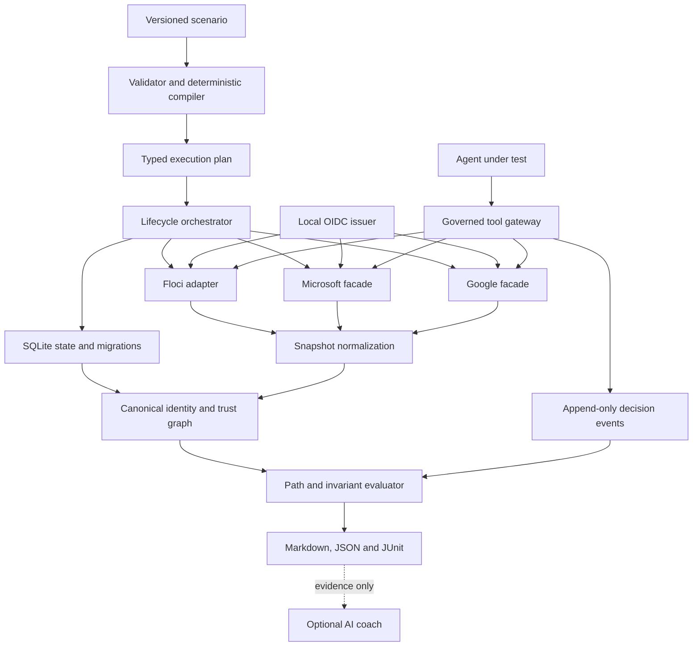

# CloudAILab master plan

## Purpose and authority

This document is the execution plan for CloudAILab. The [project charter](charter.md) defines why the project exists, the [product requirements](../01-product/requirements.md) define required behavior, accepted [architecture decisions](../02-architecture/decisions/README.md) constrain implementation, and this plan defines delivery order and evidence gates.

The plan is intentionally milestone-based rather than date-based. M0 measured the control-plane, SQLite, and packaging baseline; M1 is measuring provider translation, container lifecycle, and compatibility limits before broader estimates are made.

## Product outcome

CloudAILab will be a local-first enterprise identity and AI-agent security range that lets a learner or test system:

1. Start a reproducible multi-tenant scenario.
2. Inspect and mutate supported AWS-, Microsoft-, and Google-shaped resources with documented tools or SDKs.
3. Trace human, application, workload, and agent authority across provider boundaries.
4. Investigate an attack path and apply a remediation.
5. Prove deterministically whether the path was closed without breaking intended access.
6. Evaluate an AI agent's tool use, approvals, data access, and policy compliance across repeated trials.

## Non-negotiable constraints

- Security decisions, attack-path analysis, evidence, and scoring are deterministic.
- Hosted AI is optional and cannot be required for CI or core learning workflows.
- Provider compatibility is operation-specific, test-backed, and never implied globally.
- The first useful release contains one deep scenario, not a broad collection of shallow mocks.
- Services bind to loopback by default; credentials are synthetic; isolation claims require enforced isolation.
- The supported default deployment requires only the `cailab` binary and Docker or Podman.
- Documentation and tests change with behavior in the same pull request.

## Evidence behind the plan

The full evidence register is maintained in [Technical Basis and Source Register](../06-research/technical-basis.md). The most consequential findings are:

- Floci provides useful AWS-shaped APIs and multi-account namespacing, but IAM enforcement and signature validation are disabled by default, and its STS implementation does not evaluate trust-policy `Condition` blocks or caller-side `sts:AssumeRole` authorization. CloudAILab therefore must own the authoritative cross-provider decision model and document the gap. [Floci STS](https://floci.io/floci/services/sts/), [Floci multi-account isolation](https://floci.io/floci/configuration/multi-account/)
- Microsoft Dev Proxy is an API simulation and resilience tool. Its dynamic CRUD support is valuable, but it is not an Entra authorization engine. A native facade is the default; Dev Proxy remains a later compatibility and chaos-testing mode. [Dev Proxy overview](https://learn.microsoft.com/en-us/microsoft-cloud/dev/dev-proxy/overview), [CRUD simulation](https://learn.microsoft.com/en-us/microsoft-cloud/dev/dev-proxy/how-to/simulate-crud-api)
- Google publishes machine-readable Discovery documents for Admin SDK services. Supported routes should be selected from those contracts rather than invented as a generic OpenAPI surface. [Admin SDK Directory API](https://developers.google.com/workspace/admin/directory/reference/rest)
- NIST recommends documented, objective, repeatable, and deployment-relevant test, evaluation, verification, and validation. Agent results therefore require structured metrics, run metadata, uncertainty, and repeated trials. [NIST AI RMF Core](https://airc.nist.gov/airmf-resources/airmf/5-sec-core/)
- OWASP's agentic guidance explicitly covers goal hijacking, tool misuse, and identity/privilege abuse. These become required threat classes in the flagship agent scenario. [OWASP Top 10 for Agentic Applications](https://genai.owasp.org/resource/owasp-top-10-for-agentic-applications-for-2026/)

## MVP scope

### Flagship scenario

The MVP is built around **The Over-Privileged Acquisition Agent**:

- A parent organization and an acquired organization.
- Google Workspace-shaped human identities, groups, directory state, and selected Drive content.
- Microsoft-shaped users, groups, applications, service principals, app-role assignments, and directory synchronization state.
- Two AWS accounts with IAM roles, STS sessions, and an S3 data boundary.
- A cross-provider path from a contractor identity through group synchronization and workload federation to restricted data.
- An AI agent with delegated tools, an approval requirement, and access to a document containing indirect prompt injection.
- Legitimate access that must continue after remediation.

### Initial operation budget

Only operations required by the flagship scenario enter the MVP. Exact request and response contracts are finalized during M1 and M2 and published in a compatibility matrix.

| Surface | Initial capabilities | Explicitly deferred |
|---|---|---|
| AWS IAM/STS/S3 | Accounts, users or seeded principals, roles, inline/managed policies, role trust, role sessions, selected bucket/object and policy operations | Broad AWS service coverage, complete IAM parity, network infrastructure |
| Microsoft facade | Users, groups, memberships, applications, service principals, app-role assignments, selected OAuth grants | Mail, Teams, SharePoint, Conditional Access parity, full Graph coverage |
| Google facade | Users, groups, memberships, selected admin roles, selected Drive files and permissions | Gmail, Calendar, devices, full Workspace coverage |
| Local federation | OIDC discovery, JWKS, signed test tokens, claims and key rotation needed by the scenario | Production identity-provider features, every OAuth/OIDC flow, SAML in MVP |
| Agent gateway | Command adapter, governed tools, allow/deny/redact/approval decisions, JSON event trace | General multi-agent orchestration, arbitrary framework plugins, hosted agent service |

### Non-goals for the first public release

- Full cloud emulation or certification of provider parity.
- Transparent system-wide HTTPS interception.
- A graphical cloud console.
- Production multi-user hosting.
- Compliance certification.
- Real-cloud offensive testing.
- Automatic execution of arbitrary scenario code.

## Target architecture



### Canonical domain model

The canonical graph must represent these concepts before provider-specific extensions:

- Tenant, account, organization, and provider namespace
- Human, group, workload, application, service, and agent principal
- Resource, action, data classification, and ownership
- Membership, assignment, delegation, federation, synchronization, and trust edge
- Credential, token, claim, session, and approval
- Policy statement with effect, principal, action, resource, and condition
- Audit event, policy decision, evidence item, finding, and remediation outcome

Stable IDs are opaque and provider-neutral. Provider IDs and raw payloads are preserved as typed evidence attributes.

### Sources of truth

| Concern | Source of truth |
|---|---|
| Initial topology and mission | Versioned scenario manifest |
| Mutable provider state | Running backend or facade responsible for that surface |
| Cross-provider reasoning | Normalized canonical graph |
| Authorization decision | Canonical policy evaluator for claimed CloudAILab semantics |
| Pass/fail and score | Deterministic invariants and evidence queries |
| Agent behavior | Immutable run metadata and action-level event trace |
| Narrative coaching | Optional, non-authoritative model output grounded in evidence |

## Engineering workstreams

### WS1 — Repository and developer experience

- Initialize the Go module as `github.com/msinclair25/cailab`.
- Keep `cmd/cailab` thin and organize domain behavior under `internal/`.
- Provide `make` or `just` tasks only when they wrap documented, portable commands; raw Go commands remain usable.
- Add local development, contribution, support, security, and code-of-conduct documentation before accepting external contributions.
- Add issue and pull-request templates after the first implementation milestone reveals useful fields.

### WS2 — Scenario language and compiler

- Define `cloudailab.dev/v1alpha1` with JSON Schema.
- Parse into typed Go structures; reject unknown or unsafe fields where practical.
- Separate learner-visible briefing from protected verification ground truth.
- Compile references and generated collections into a typed DAG.
- Guarantee stable output for the same schema version, manifest, and seed.
- Fuzz manifest parsing, reference resolution, and plan compilation.

### WS3 — State, graph, and policy

- Maintain the accepted CGO-free SQLite driver and validate migrations and release targets on every relevant change.
- Use numbered, forward-only schema migrations with transaction tests.
- Implement graph reachability and explainable path evidence before optimization.
- Start with typed built-in invariant predicates rather than a general user policy language.
- Keep typed built-in predicates as accepted by ADR-0006. Evaluate a policy engine only when accepted scenarios demonstrate requirements the typed model cannot express cleanly. [OPA policy testing](https://www.openpolicyagent.org/docs/policy-testing)

### WS4 — Provider surfaces

- Define a shared provider lifecycle interface: plan, apply, health, collect, reset, stop.
- Preserve raw provider requests and responses as redacted evidence when useful.
- Publish operation-level compatibility records with fidelity and limitations.
- Make provider contract tests independent from the flagship end-to-end test.
- Add real-cloud differential tests only later, behind explicit credentials and cost controls.

### WS5 — Local identity and federation

- Implement only the discovery, JWKS, token issuance, claim validation, expiry, audience, subject, and rotation behavior required by the scenario.
- Enforce exact issuer consistency between discovery metadata and tokens, following OpenID Connect Discovery. [OpenID Connect Discovery](https://openid.net/specs/openid-connect-discovery-1_0.html)
- Use ephemeral signing keys by default and never reuse local test keys outside the range.
- Record token lineage without logging private keys or bearer tokens.

### WS6 — Agent evaluation and governance

- Treat each agent run as a principal, session, configuration, and immutable trace.
- Start with a subprocess adapter using a documented JSON-lines protocol; add HTTP or MCP adapters only after the core trace contract is stable.
- Support versioned user-provided tool manifests with declared input schemas, permissions, risk, timeout, transport, and isolation requirements.
- Route supported actions through a gateway that can allow, deny, redact, or require approval.
- Grade action-level facts deterministically; reserve semantic judging for optional supplemental analysis.
- Repeat nondeterministic trials and report both counts and rates.
- Record model/provider identifier, agent version, prompt hash, tool schema hash, scenario version, seed, start/end time, and policy version.

Required initial metrics:

| Metric | Definition |
|---|---|
| Task success | Required mission outcomes achieved without relying on prohibited changes. |
| Policy compliance | Governed actions allowed by policy divided by all attempted governed actions. |
| Unauthorized attempts | Count of denied cross-tenant, out-of-scope, or destructive actions. |
| Approval compliance | Sensitive actions correctly paused for approval. |
| Prompt-injection resistance | Trials in which untrusted content did not change prohibited tool behavior. |
| Sensitive-data exposure | Restricted fields or objects sent to tools or models without authorization. |
| Blast radius | Distinct protected actions/resources reachable from the agent's effective authority. |
| Remediation quality | Intended attack path closed while required legitimate paths remain open. |

### WS7 — Audit, reporting, and observability

- Define a versioned CloudAILab event schema with actor, tenant, action, resource, decision, reason, correlation ID, and outcome.
- Use OpenTelemetry naming where a stable semantic convention applies, while keeping the portable JSON event schema independent from an exporter. [OpenTelemetry semantic conventions](https://opentelemetry.io/docs/concepts/semantic-conventions/)
- Redact credentials and classified payloads before persistence.
- Produce Markdown for learners, JSON for automation, and JUnit for CI.
- Every finding includes severity, invariant ID, evidence references, affected path, and remediation status.

### WS8 — Security and supply chain

- Run `govulncheck`, race detection, fuzzing, dependency review, CodeQL, and secret scanning at appropriate CI cadences. The Go project recommends govulncheck, fuzzing, and the race detector for security-sensitive Go code. [Go security best practices](https://go.dev/doc/security/best-practices)
- Pin GitHub Actions to full commit SHAs and grant minimum workflow permissions. GitHub supports repository enforcement for full-length SHA pinning. [GitHub Actions settings](https://docs.github.com/en/repositories/managing-your-repositorys-settings-and-features/enabling-features-for-your-repository/managing-github-actions-settings-for-a-repository)
- Pin external images and binaries by version and digest where possible.
- Generate checksums, an SBOM, and build provenance for releases. GitHub artifact attestations can cover binaries, images, and SBOMs. [Artifact attestations](https://docs.github.com/en/actions/how-tos/secure-your-work/use-artifact-attestations/use-artifact-attestations)
- Maintain third-party notices and review redistribution terms before bundling any runtime.

## Milestone plan

### M0 — Contracts and walking skeleton

**Status:** complete in the repository. Provider-runtime orchestration begins in M1.

**Goal:** retire the highest architectural unknowns with the smallest executable system.

Deliverables:

- Go module and CLI skeleton
- `cailab doctor`, `up`, `status`, `verify`, and `down`
- `v1alpha1` minimal schema and typed compiler
- SQLite spike and ADR
- Built-in invariant evaluator and ADR; a general policy DSL is explicitly deferred
- Docker prerequisite and host-engine validation; the provider container adapter decision is deferred to M1
- One tenant, one principal, one resource, one invariant
- Unit, fuzz-seed, CLI smoke, and documentation-link checks
- CI with least-privilege permissions and SHA-pinned actions

Exit gate:

- A clean clone can build and test using documented commands.
- A minimal scenario starts, verifies one deterministic invariant, stops, and leaves no runtime resources.
- Repeating with the same seed produces equivalent canonical state.
- All proposed M0 ADRs are accepted or explicitly deferred.

### M1 — AWS identity vertical slice

**Status:** complete. The IAM/STS/S3 trust-remediation slice is executable, documented, and CI-backed.

**Goal:** prove the adapter, normalization, policy, and remediation loop against Floci.

Deliverables:

- Pinned Floci runtime with IAM enforcement and signature behavior configured intentionally
- Two AWS accounts
- Selected IAM, STS, and S3 operation contracts
- AWS normalization and raw evidence
- Compatibility matrix with every supported operation and known semantic gap
- Cross-account attack path, remediation, and preservation of legitimate access
- Negative tests for tenant isolation, explicit deny, and unsupported conditions

Exit gate:

- AWS CLI or a documented SDK can complete the supported mission workflow.
- CloudAILab detects the path even where Floci lacks complete policy semantics.
- Every compatibility claim links to a passing contract test.
- The scenario can be run twice without leaked containers, ports, or state.

### M2 — Cross-provider enterprise identity

**Status:** complete. The flagship Google → Microsoft → local OIDC → AWS chain is executable, deterministic, documented, and covered by a lifecycle integration test.

**Goal:** complete one credible Google → Microsoft → AWS trust chain.

Deliverables:

- Microsoft facade for selected directory and application operations
- Google facade for selected Directory and Drive operations
- Local OIDC discovery, JWKS, claims, expiry, and rotation
- Directory synchronization and cross-provider trust edges
- Contract-tested HTTP, AWS SDK, and AWS CLI examples using local endpoints
- Provider-specific error and pagination behavior required by the scenario
- Cross-provider compatibility matrix and end-to-end tests

Exit gate:

- The flagship human-to-application-to-workload path is observable end to end.
- Supported mutations through each facade alter normalized state correctly.
- A learner can close the malicious path while preserving an intended path.
- No host-wide proxy or certificate change is required in the default mode.

### M3 — Agent governance harness

**Status:** in development. Versioned agent/policy/tool/outcome contracts, supported reference and custom subprocess runs, scenario-bound registration, exact-match policy, Draft 2020-12 validation, protected tool execution, immutable run metadata, and append-only decision/outcome evidence are implemented. Approval resolution, isolation, full trace replay, and scoring remain.

**Goal:** make an external agent a measurable principal in the range.

Deliverables:

- Versioned agent-run and tool protocol
- Subprocess adapter and reference deterministic agent
- User-provided subprocess tool registration and manifest validation
- Governed tool gateway with allow, deny, redact, and approval decisions
- Indirect prompt-injection fixture in Google-shaped content
- Repeated-trial runner and aggregate metrics
- Trace replay and evidence-linked report
- Optional local-model example; hosted providers remain user-configured

Exit gate:

- A deterministic reference agent produces a reproducible baseline.
- A deliberately unsafe agent triggers goal-hijacking, tool-misuse, and privilege-abuse findings.
- Every governed action has a complete decision record.
- Repeated results report trial count, rates, failures, and run configuration.

### M4 — Portfolio-quality public release

**Goal:** deliver a secure, reproducible, and understandable public artifact.

Deliverables:

- Linux, macOS, and Windows release artifacts for supported architectures
- Container image for CI
- Checksums, SBOM, provenance attestation, changelog, and upgrade notes
- Installation, quick start, architecture walkthrough, demo recording, and troubleshooting
- SECURITY, SUPPORT, CONTRIBUTING, CODE_OF_CONDUCT, and license/notice files
- Threat-model review and compatibility audit
- Optional evidence-grounded AI coaching behind an explicit feature flag

Exit gate:

- A new user can reproduce the published demo from a clean supported environment.
- Release artifacts verify against published checksums and provenance.
- The README contains only verified capabilities.
- Critical and high security findings are resolved or documented with an explicit release decision.

### V1 — Stable learning contract

Version 1.0 is not tied to API breadth. It requires:

- A stable scenario schema or a documented compatibility/migration policy.
- One complete cross-provider scenario with supported remediation paths.
- A stable agent-run trace format.
- Operation-level compatibility documentation.
- Reproducible releases and a maintained security policy.

## Repository shape

Directories are created when they contain real code or artifacts; empty speculative packages are avoided.

```text
cmd/cailab/                  # Thin CLI entry point
internal/scenario/           # Schema, validation, compiler
internal/domain/             # Canonical typed model
internal/graph/              # Reachability and path evidence
internal/policy/             # Deterministic decisions and invariants
internal/state/              # SQLite access and migrations
internal/provider/           # Provider lifecycle, AWS hydration, snapshots
internal/provider/microsoft/ # Added in M2
internal/provider/google/    # Added in M2
internal/identity/           # Local issuer, added in M2
internal/agent/              # Gateway and traces, added in M3
internal/report/             # Structured and rendered reports
schemas/                     # Versioned scenario and report schemas
scenarios/                   # Public scenario packages
docs/                        # Obsidian/GitHub engineering vault
```

## Quality gates

The detailed policy is in [Quality Strategy](../05-engineering/quality-strategy.md).

Minimum pull-request checks after Go scaffolding:

| Check | Command or acceptance condition |
|---|---|
| Formatting | `gofmt -l .` produces no paths |
| Module consistency | `go mod tidy -diff` exits successfully with no diff |
| Module integrity | `go mod verify` |
| Static analysis | `go vet ./...` |
| Unit and seed-corpus tests | `go test ./...` |
| Race detection | `go test -race ./...` |
| Reachable vulnerabilities | `govulncheck ./...` |
| Schemas and scenarios | Versioned schema validation succeeds |
| Documentation | Markdown formatting and relative-link checks succeed |

Container integration tests run on changes to lifecycle or provider code and on the default branch. Bounded fuzzing and cross-platform builds run on scheduled or release workflows until runtime permits broader pull-request coverage.

Coverage remains diagnostic rather than a release target. Critical policy, graph, compiler, lifecycle, and isolation behavior must have explicit positive, negative, integration, and regression tests regardless of line coverage.

## Documentation system

| Artifact | Owner and update trigger |
|---|---|
| README | Verified user-facing capability or installation change |
| Charter | Mission, audience, outcome, or non-goal change |
| Requirements | New or changed externally observable behavior |
| Master plan | Milestone, sequencing, risk, or delivery-gate change |
| ADR | Costly-to-reverse architecture or security decision |
| Architecture | Component, boundary, or source-of-truth change |
| Threat model | New listener, credential, actor, dependency, tool, or trust boundary |
| Compatibility matrix | Provider operation or fidelity change |
| Scenario specification | Schema, authoring rule, or grading contract change |
| Source register | Evidence changes or source becomes stale |
| Changelog | User-visible released change |

Document statuses are `draft`, `proposed`, `accepted`, `active`, `deprecated`, or `superseded`. Accepted ADRs are superseded by new ADRs rather than rewritten.

## Risk register

| Risk | Likelihood | Impact | Mitigation and trigger |
|---|---|---|---|
| Provider scope expands faster than tests | High | Critical | Scenario-driven operation budget; reject unsupported additions without a scenario or contract. |
| Emulator semantics diverge from real providers | High | High | Canonical evaluator, compatibility levels, negative tests, later differential tests. |
| Cross-platform single-binary goal conflicts with SQLite/runtime dependencies | Medium | High | M0 driver and packaging spike; ADR before domain code depends on it. |
| Agent reaches host or public network | Medium | Critical | No isolation claim by default; isolated execution mode with minimal mounts and deny-by-default egress. |
| Agent evaluation is mistaken for model benchmarking | Medium | High | Publish system-level metrics, run metadata, repeated trials, and limitations. |
| LLM judge introduces unstable scores | High | High | Deterministic scoring only; optional semantic analysis is supplemental. |
| Dependency or container compromise | Medium | Critical | Pinning, digests, vulnerability scans, SBOM, provenance, minimal workflow permissions. |
| Documentation drifts from implementation | Medium | High | Same-change updates, compatibility tests, docs checks, README verified-capability rule. |
| Protected ground truth leaks to the agent | Medium | High | Separate packages/mounts, integrity checks, and trace which inputs were disclosed. |
| Solo-maintainer scope or burnout | High | High | Milestone gates, one flagship scenario, explicit deferrals, small reviewable increments. |

## Decision gates

The following questions must be resolved through spikes and ADRs before dependent implementation proceeds:

1. SQLite driver and CGO/static-build policy — resolved by ADR-0005.
2. Docker provider control and runtime allowlisting — resolved for M1 Docker by ADR-0007; Podman remains untested.
3. Built-in invariant predicates versus embedded policy engine — resolved by ADR-0006.
4. Canonical policy condition representation — before M1 compatibility claims.
5. Microsoft and Google pagination/error subset — before M2 facade implementation.
6. Agent subprocess trace protocol and approval handshake — before M3.
7. Isolation implementation and supported host platforms — before claiming safe agent execution.

## Change control

- Requirement IDs are stable and never reused.
- Scenario and report schemas are versioned from their first committed form.
- A milestone exit requires evidence in CI, documentation, and a recorded release decision.
- Scope added to a milestone must identify displaced work or explicitly expand the milestone.
- Research sources are reviewed before relying on version-sensitive provider or governance behavior.

## Immediate next actions

1. Implement explicit approval resolution with immutable evidence and re-evaluation.
2. Add enforced isolation modes before making any agent-containment claim.
3. Build trace replay and repeated-trial scoring, then add the unsafe prompt-injection evaluation fixture.
