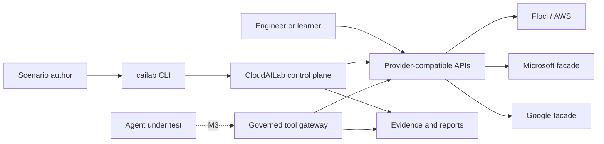
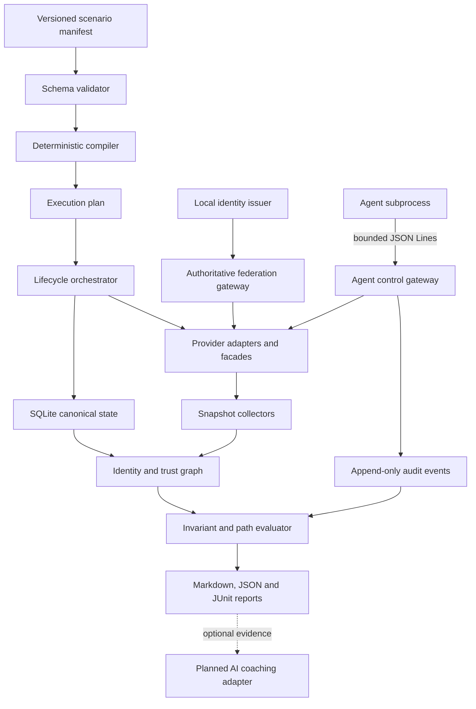

# System architecture

## Context

CloudAILab is a local control plane that compiles scenarios, orchestrates provider-shaped runtimes, records activity, and evaluates resulting state. External engineers, scripts, and AI agents use familiar protocols against intentionally limited local services.

## Logical components

## Sources of truth

- The selected **scenario manifest** is the source of initial topology and mission intent. Named built-ins come from the immutable catalog compiled into the executable; custom filesystem sources require explicit selection.
- **Provider backends** are the source of mutable current state after startup.
- The **normalized graph** is the source used for cross-provider reasoning.
- **Deterministic invariants** are the source of pass/fail decisions.
- AI output is commentary and never a source of authorization or score truth.

## Initial technology choices

| Concern | Proposed choice | Rationale |
|---|---|---|
| Control plane | Go | Portable CLI, concurrency, static distribution. |
| Canonical state | Embedded SQLite | Transactions, snapshots, diffs, and no separate database. |
| AWS runtime | Allowlisted, digest-pinned Floci through Docker | Local AWS-shaped IAM/STS/S3 services, multi-account support, live snapshots, and bounded compatibility claims. |
| Microsoft surface | Native scoped facade | Avoid mandatory global proxy and certificate setup. |
| Google surface | Native scoped facade generated from selected Discovery contracts | Focus implementation on scenario-required operations. |
| Local federation | Embedded OIDC issuer and policy evaluator | Reproducible tokens and cross-provider trust semantics. |
| Reports | Markdown, JSON, JUnit | Obsidian/GitHub readability and CI integration. |

Accepted choices and their constraints are recorded in ADRs.

## Runtime deployment

The current default is one `cailab` binary, with the documented local Docker configuration required only for container-backed scenarios. The binary starts run-scoped native facade subprocesses and manages pinned external containers. Podman remains an untested target. Transparent HTTPS interception, host certificate installation, and hosted AI are optional advanced modes.

The repository-owned scenario catalog is compiled into that binary. Default commands do not discover an ambient `./scenarios` directory; explicit paths and catalog flags preserve custom scenario workflows. Both sources enter the same strict validation and deterministic compilation boundary. Embedding establishes distribution and explicit source selection, not confidentiality from the launching OS account. See [ADR-0024](decisions/0024-embedded-built-in-scenario-catalog.md).

M1 tests Docker only. Floci runs as an unprivileged user with dropped capabilities, resource limits, no Docker socket mount, and a random loopback-only API port. Podman remains a target rather than an implemented compatibility claim.

M2's Microsoft and Google facades and local identity issuer run as detached private commands of the same binary through one provider-neutral lifecycle manager. Each binds to a random IPv4 loopback port and uses an owner-only run directory plus authenticated run-scoped control. A PID is diagnostic rather than cleanup authority. See [ADR-0008](decisions/0008-managed-native-facade-processes.md) and [ADR-0009](decisions/0009-local-development-oidc-profile.md).

The M2 federation command validates signed local identity, current Microsoft assignment state, and typed AWS web trust before invoking Floci for temporary credentials. The pinned Floci runtime remains directly reachable on loopback and does not enforce that gateway decision; direct access is outside the supported authorization contract. Enforced agent mediation and isolation are M3 work. See [ADR-0010](decisions/0010-authoritative-web-identity-gateway.md).

M3's public agent workflows launch deterministic inert reference, fixture-specific safe, deliberately unsafe, or configured protocol subprocess agents behind the governed tool gateway. The controller binds canonical targets, policy, approvals, protected output, and immutable linked evidence. Startup captures a normalized provider-state baseline; evaluated trials can restore owned runtimes at stable loopback endpoints and append before/after invariant reports. Scenario-owned injection ground truth is persisted but omitted from `session.start`; replay derives exposure, later prohibited behavior, attack success, and gateway containment from exact linked action evidence without running a model. Paired safe/unsafe controls validate positive and negative fixture behavior without implying model-general resistance. Host agents and tools remain unisolated. Optional Docker agent mode enforces the documented content-addressed, network-none, read-only, non-root boundary; tools remain on the trusted host side. See [ADR-0011](decisions/0011-versioned-agent-json-lines-protocol.md) through [ADR-0022](decisions/0022-paired-fixture-specific-agent-controls.md).

## Release pipeline

M4 uses a repository-owned Go packager as the source of archive layout and checksum selection. It creates fixed CGO-free targets from explicit version, commit, and source-date inputs; Syft inventories the staged binaries in SPDX JSON; and Linux, macOS, and Windows jobs verify the full manifest before executing their native archive. Pull requests and manual runs stop at a short-lived release candidate. Tags alone enter separate GitHub/Sigstore attestation and publication jobs with narrowly scoped write permissions. See [ADR-0023](decisions/0023-release-artifact-provenance-pipeline.md) and the [release verification guide](../07-guides/release-verification.md).

The same packager requires a self-contained legal/documentation bundle: project license and notice, changelog, third-party notice index, and copied license material for the Go runtime and linked modules. A code-owned command computes the union of modules linked into every declared release target; CI and release jobs compare it with the versioned inventory before packaging. See [ADR-0026](decisions/0026-apache-license-release-notice-bundle.md).

Separately, every pull request and `main` build creates an ephemeral CI-only Linux image from a digest-pinned Docker Official Go builder. A multi-stage build leaves only the CGO-free CLI and CGO-free code-owned demo runner in a `scratch`-based non-root image. CI inspects that contract and runs the walking skeleton with Docker's `none` network, no host mounts, a read-only root, bounded writable temporary storage, reduced privileges, and resource limits. The image is not published and is not a release or agent-isolation surface. See [ADR-0025](decisions/0025-ci-only-clean-demo-container.md) and the [clean container demo](../07-guides/clean-container-demo.md).

## Compatibility policy

Every provider operation must have:

1. A documented fidelity level.
2. Contract tests for accepted requests and responses.
3. Authorization tests when authorization compatibility is claimed.
4. Side-effect and audit tests when behavior compatibility is claimed.
5. A documented limitation when provider behavior is intentionally omitted.
