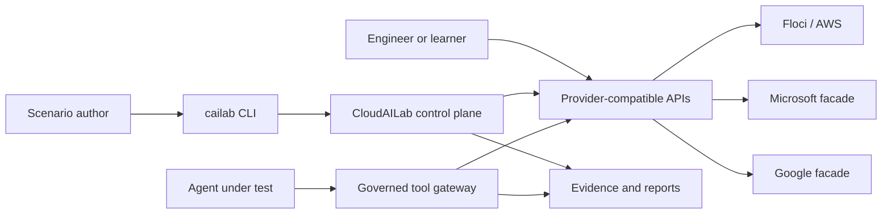
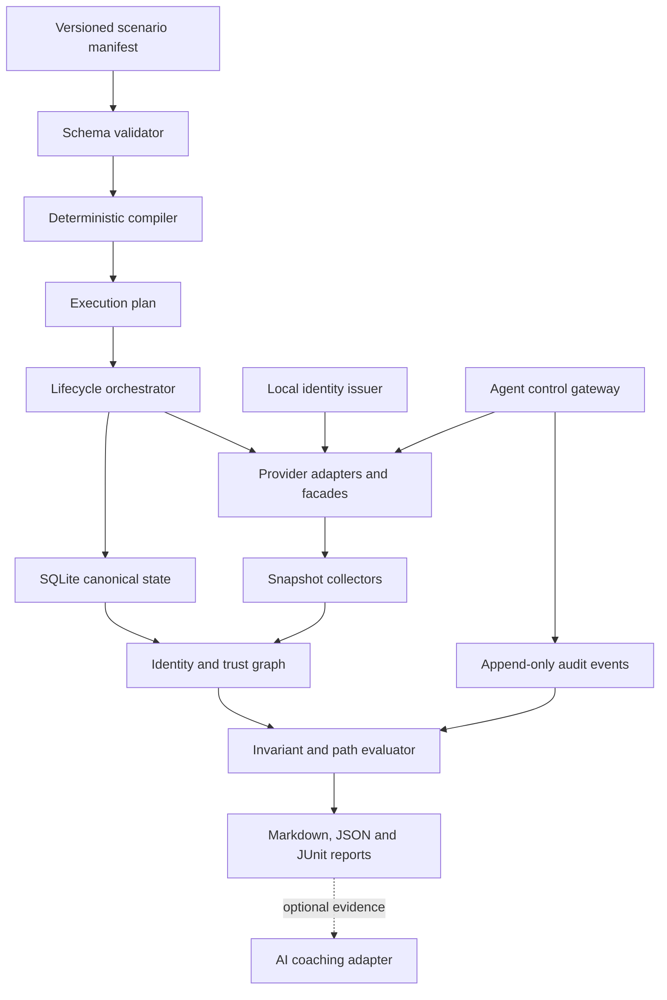

# System architecture

## Context

CloudAILab is a local control plane that compiles scenarios, orchestrates provider-shaped runtimes, records activity, and evaluates resulting state. External engineers, scripts, and AI agents use familiar protocols against intentionally limited local services.

## Logical components

## Sources of truth

- The **scenario manifest** is the source of initial topology and mission intent.
- **Provider backends** are the source of mutable current state after startup.
- The **normalized graph** is the source used for cross-provider reasoning.
- **Deterministic invariants** are the source of pass/fail decisions.
- AI output is commentary and never a source of authorization or score truth.

## Initial technology choices

| Concern | Proposed choice | Rationale |
|---|---|---|
| Control plane | Go | Portable CLI, concurrency, static distribution. |
| Canonical state | Embedded SQLite | Transactions, snapshots, diffs, and no separate database. |
| AWS runtime | Floci | Local AWS-shaped services and multi-account support. |
| Microsoft surface | Native scoped facade | Avoid mandatory global proxy and certificate setup. |
| Google surface | Native scoped facade generated from selected Discovery contracts | Focus implementation on scenario-required operations. |
| Local federation | Embedded OIDC issuer and policy evaluator | Reproducible tokens and cross-provider trust semantics. |
| Reports | Markdown, JSON, JUnit | Obsidian/GitHub readability and CI integration. |

These are proposed decisions. Accepted choices are recorded in ADRs.

## Runtime deployment

The target default is one `cailab` binary plus Docker or Podman. The binary runs embedded services and manages pinned external containers. Transparent HTTPS interception, host certificate installation, and hosted AI are optional advanced modes.

## Compatibility policy

Every provider operation must have:

1. A documented fidelity level.
2. Contract tests for accepted requests and responses.
3. Authorization tests when authorization compatibility is claimed.
4. Side-effect and audit tests when behavior compatibility is claimed.
5. A documented limitation when provider behavior is intentionally omitted.
