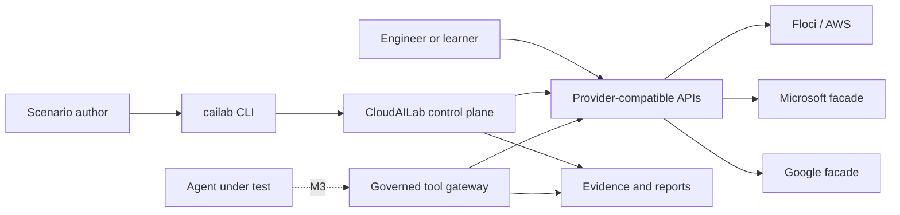
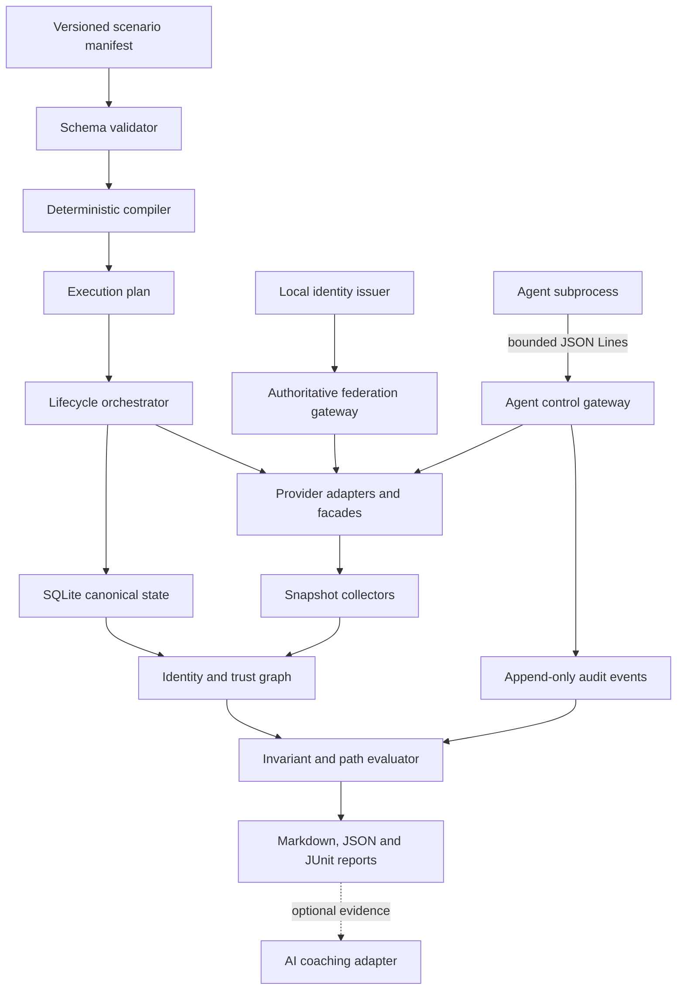

# System architecture

## Context

CloudAILab is a local control plane that compiles scenarios, orchestrates provider-shaped runtimes, records activity, and evaluates resulting state. External engineers, scripts, and AI agents use familiar protocols against intentionally limited local services.

## Logical components

## Sources of truth

- The **scenario manifest** is the source of initial topology and mission intent.
- **Provider backends** are the source of mutable current state after startup.
- The **normalized graph** is the source used for cross-provider reasoning.
- **Deterministic invariants** are the source of pass/fail decisions.
- AI output is commentary and never a source of authorization or score truth.

## Initial technology choices

| Concern | Proposed choice | Rationale |
|---|---|---|
| Control plane | Go | Portable CLI, concurrency, static distribution. |
| Canonical state | Embedded SQLite | Transactions, snapshots, diffs, and no separate database. |
| AWS runtime | Allowlisted, digest-pinned Floci through Docker | Local AWS-shaped IAM/STS/S3 services, multi-account support, live snapshots, and bounded compatibility claims. |
| Microsoft surface | Native scoped facade | Avoid mandatory global proxy and certificate setup. |
| Google surface | Native scoped facade generated from selected Discovery contracts | Focus implementation on scenario-required operations. |
| Local federation | Embedded OIDC issuer and policy evaluator | Reproducible tokens and cross-provider trust semantics. |
| Reports | Markdown, JSON, JUnit | Obsidian/GitHub readability and CI integration. |

Accepted choices and their constraints are recorded in ADRs.

## Runtime deployment

The target default is one `cailab` binary, with Docker or Podman required only for container-backed scenarios. The binary starts run-scoped native facade subprocesses and manages pinned external containers. Transparent HTTPS interception, host certificate installation, and hosted AI are optional advanced modes.

M1 tests Docker only. Floci runs as an unprivileged user with dropped capabilities, resource limits, no Docker socket mount, and a random loopback-only API port. Podman remains a target rather than an implemented compatibility claim.

M2's Microsoft and Google facades and local identity issuer run as detached private commands of the same binary through one provider-neutral lifecycle manager. Each binds to a random IPv4 loopback port and uses an owner-only run directory plus authenticated run-scoped control. A PID is diagnostic rather than cleanup authority. See [ADR-0008](decisions/0008-managed-native-facade-processes.md) and [ADR-0009](decisions/0009-local-development-oidc-profile.md).

The M2 federation command validates signed local identity, current Microsoft assignment state, and typed AWS web trust before invoking Floci for temporary credentials. The pinned Floci runtime remains directly reachable on loopback and does not enforce that gateway decision; direct access is outside the supported authorization contract. Enforced agent mediation and isolation are M3 work. See [ADR-0010](decisions/0010-authoritative-web-identity-gateway.md).

M3's public `agent validate` and `agent run` workflows load bounded scenario-bound policy/tool documents and launch either the deterministic reference agent or an explicitly configured protocol-compatible subprocess. Protocol 1.1 makes action/resource targets explicit; the controller supplies canonical metadata, enforces policy and approvals, protects successful output, and commits immutable linked evidence. Opt-in trial-state evaluation restores owned providers without changing loopback endpoints, proves the canonical baseline digest before launch, and appends deterministic before/after invariant reports. SQLite verifies run, decision, approval, outcome, and state evidence on read. `agent replay` projects a complete compatible set into transparent action metrics and, when state evidence is complete, task/remediation rates without re-executing the agent, tools, providers, policy, or a model. Host agent and tool subprocesses remain unisolated. The opt-in Docker agent adapter instead uses a content-addressed image with no host mounts or forwarded environment, `--network none`, a read-only root and bounded tmpfs, non-root execution, dropped capabilities, built-in seccomp, resource limits, and ownership-checked cleanup; tools still execute on the trusted host side. See [ADR-0011](decisions/0011-versioned-agent-json-lines-protocol.md), [ADR-0012](decisions/0012-owned-agent-subprocess-sessions.md), [ADR-0013](decisions/0013-deterministic-tool-policy-and-evidence.md), [ADR-0014](decisions/0014-strict-one-shot-tool-execution.md), [ADR-0015](decisions/0015-scenario-bound-public-agent-runs.md), [ADR-0016](decisions/0016-immutable-approval-resolution.md), [ADR-0017](decisions/0017-opt-in-docker-agent-isolation.md), [ADR-0018](decisions/0018-deterministic-agent-evidence-replay.md), and [ADR-0019](decisions/0019-endpoint-preserving-trial-state-evaluation.md).

## Compatibility policy

Every provider operation must have:

1. A documented fidelity level.
2. Contract tests for accepted requests and responses.
3. Authorization tests when authorization compatibility is claimed.
4. Side-effect and audit tests when behavior compatibility is claimed.
5. A documented limitation when provider behavior is intentionally omitted.
