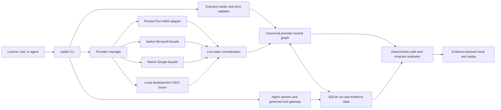

# Architecture walkthrough

CloudAILab separates provider-shaped interfaces from its authoritative security model. A provider emulator or facade can supply request/response behavior and mutable state, but deterministic compilation, normalization, authorization, attack-path evaluation, evidence, and scoring remain CloudAILab-owned.

## Scenario compilation

Built-in YAML manifests are embedded in the executable. External manifests are accepted only through explicit file/catalog selection. Both sources pass through the same strict schema, typed validation, deterministic compiler, provider-operation allowlist, and invariant predicate set. Scenario data never selects arbitrary executable images or implicit shell text.

## Canonical state and verification

The canonical graph models identities, groups, applications, workloads, authorization grants, trust, and resources with stable provider-neutral identifiers. Provider-native evidence is retained on normalized nodes and relationships. Path queries and verification refresh supported live provider state before evaluating deterministic rules; a language model is not part of an authorization or scoring decision.

SQLite stores compiled runs, runtime ownership, baselines, agent configuration, append-only decisions, approvals, outcomes, state evidence, and integrity hashes. Equivalent state—not timestamps—drives verification and replay results.

## Provider boundary

- **AWS:** a digest-pinned Floci runtime supplies selected IAM/STS/S3-shaped behavior. CloudAILab compensates for documented authorization gaps and never treats direct permissive emulator behavior as proof.
- **Microsoft:** a managed native loopback process exposes selected Graph-shaped resources and mutations backed by scenario state.
- **Google:** a managed native loopback process exposes selected Directory and Drive-shaped resources and mutations.
- **OIDC:** a managed development issuer provides signed synthetic tokens and rotation over loopback HTTP; it is intentionally not a production OpenID Provider.

Every compatibility claim is operation-specific and points to contract or integration tests. See the [compatibility index](../07-compatibility/README.md).

## Agent boundary

The public agent protocol is versioned JSON Lines. CloudAILab owns the direct child lifecycle, validates strict messages and tool schemas, applies deterministic allow/deny/redact/approval policy, persists decisions before side effects, protects successful output, and links outcomes before returning results.

Host-mode agents and all registered tool subprocesses remain unisolated. A custom agent can opt into the documented Linux Docker boundary, but Docker Engine and the host kernel remain trusted and tools still execute on the host. Fixture-specific safe/unsafe controls demonstrate the evaluation machinery; they do not establish general model resistance.

## Lifecycle and cleanup

`up` validates and compiles before starting provider runtimes. Runtime records include run ownership and endpoint state. `reset` replaces only owned resources and restores the compiled baseline; `down` checks ownership before cleanup and is designed to be idempotent. A PID, container name, or user-supplied path alone is never sufficient cleanup authority.

## Distribution boundary

Release archives are CGO-free and carry the embedded catalog plus the legal notice bundle. The release asset set adds the checksum manifest and SPDX SBOM; workflow records provide native smoke evidence and tag-only attestations. The separate CI demo image is an ephemeral clean-environment test and is neither a release distribution nor an agent sandbox.
